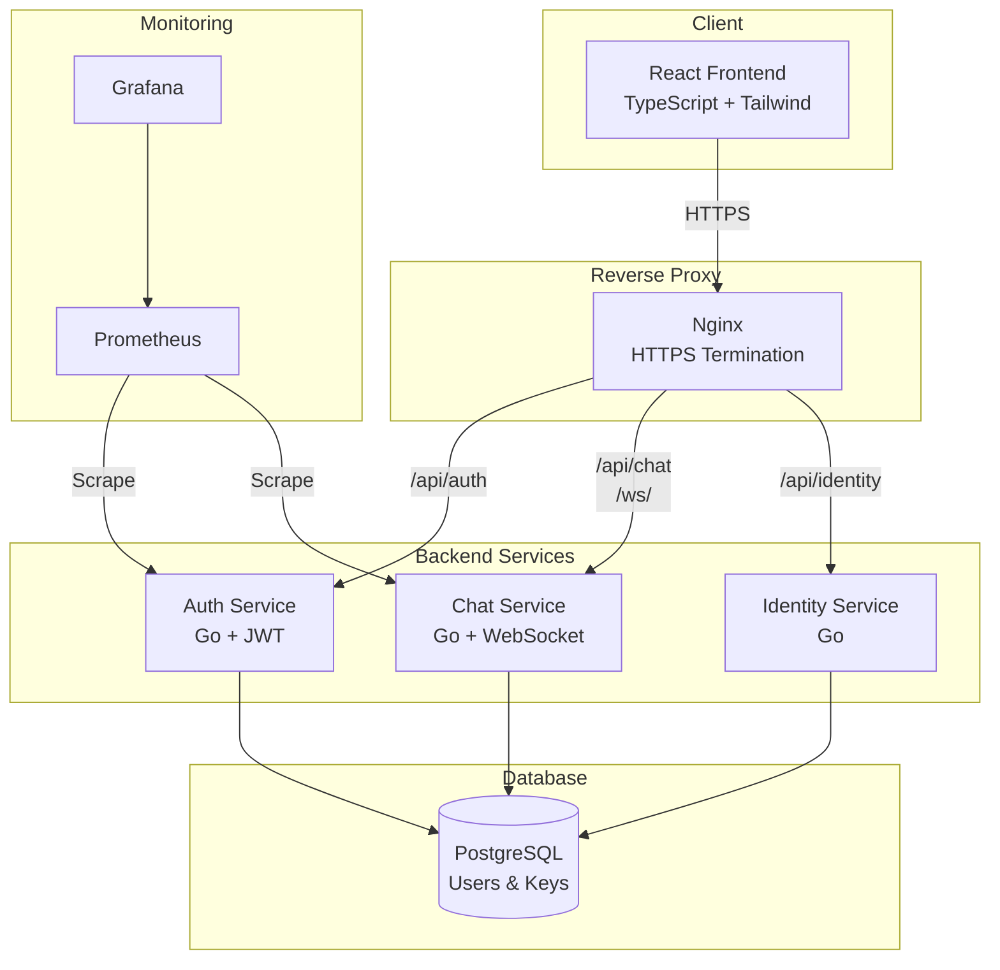
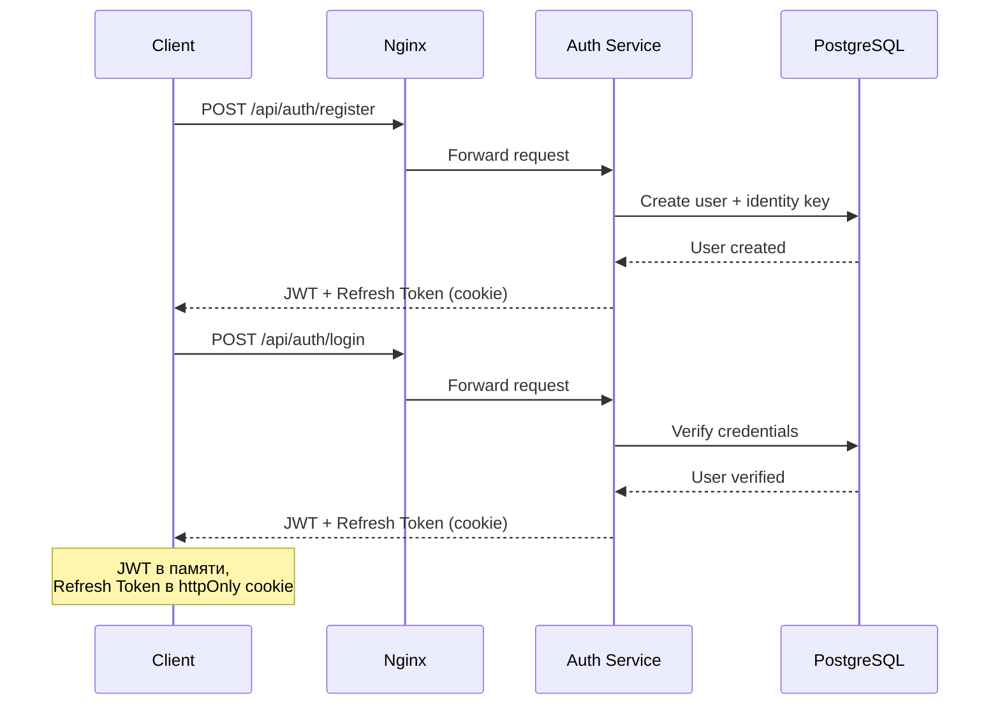
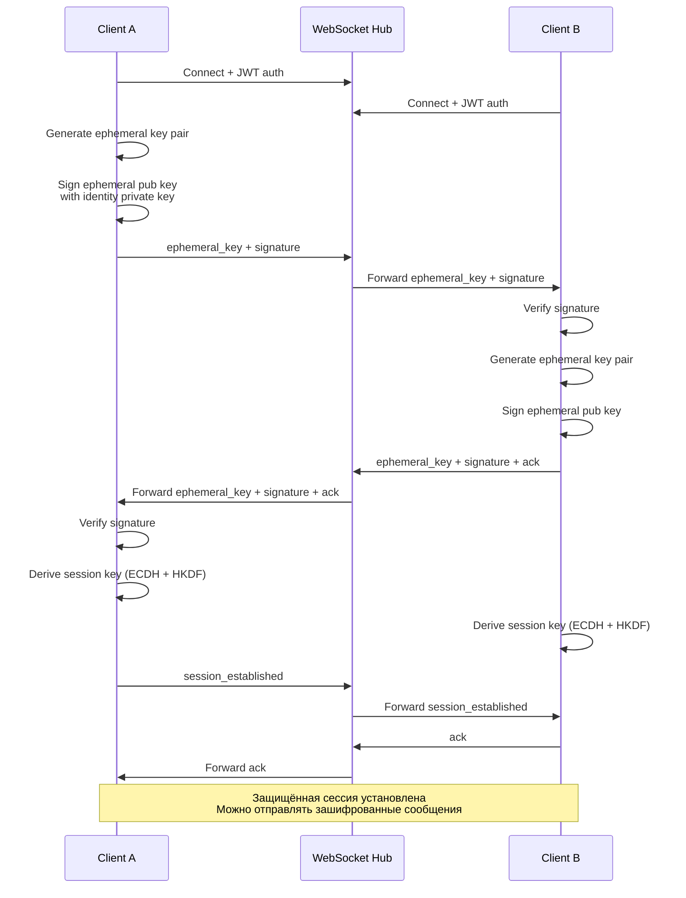
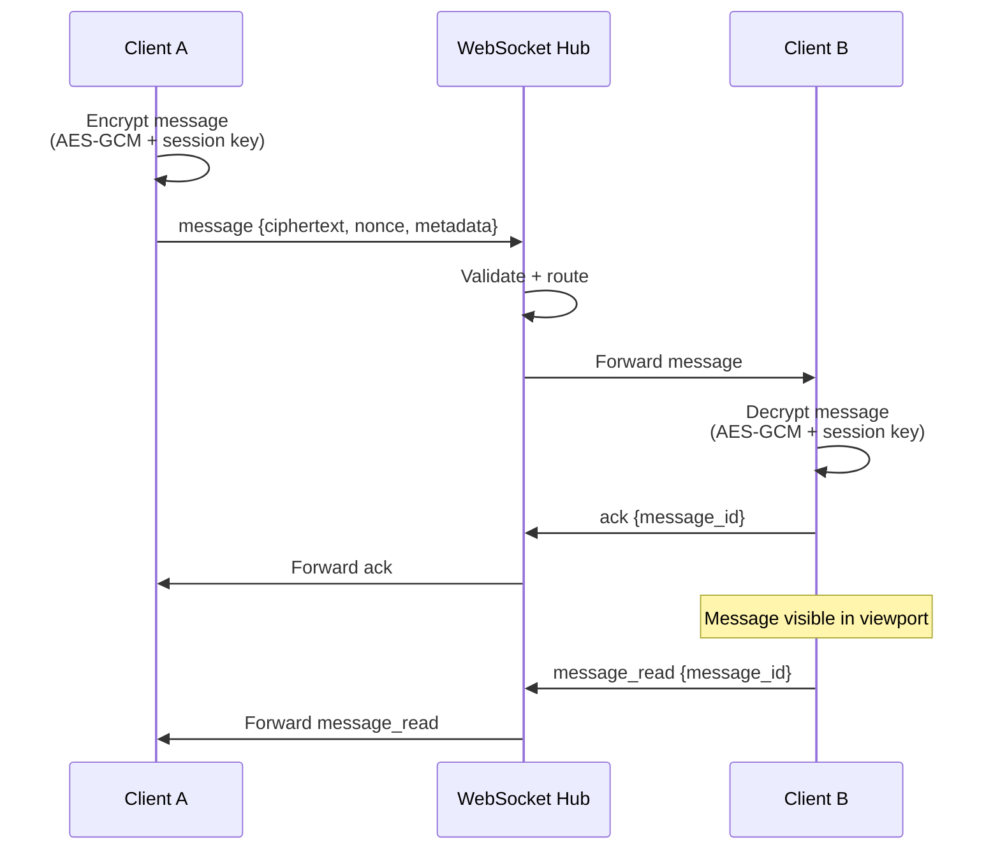
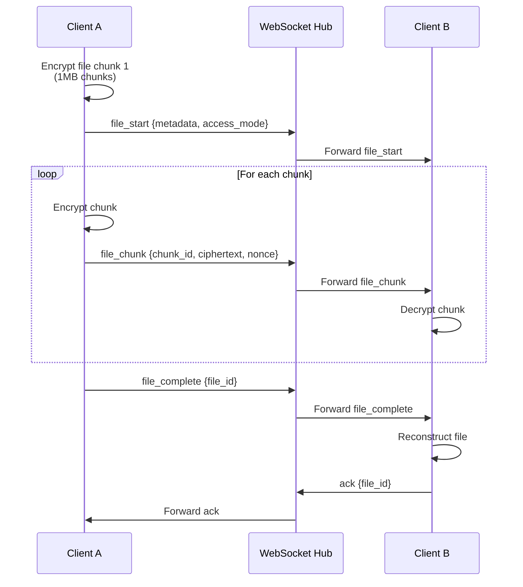
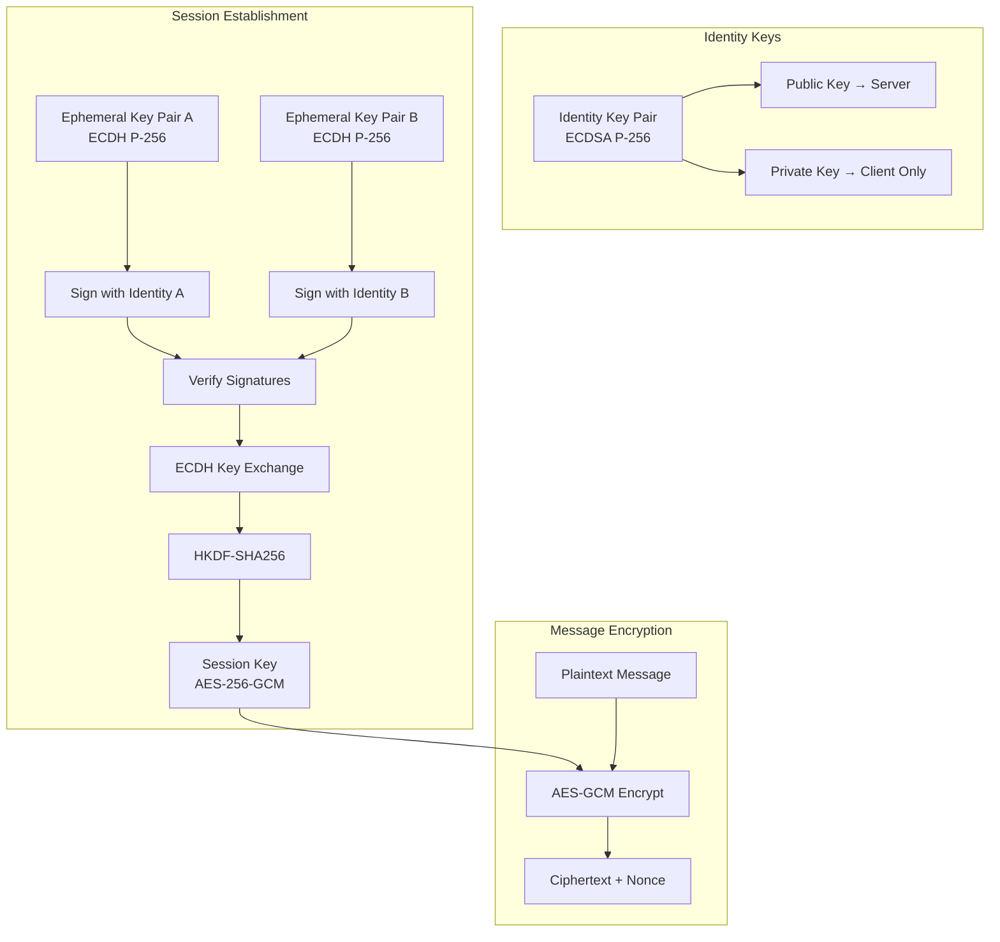

# dh-secure-chat

> End-to-end зашифрованный real-time мессенджер 1-на-1 с использованием Diffie-Hellman для установления сессионного ключа и симметричного шифрования на клиенте.

[](https://golang.org/)
[](https://www.typescriptlang.org/)
[](https://react.dev/)

---

## Содержание

- [Быстрый старт](#быстрый-старт)
- [Архитектура](#архитектура)
- [Основные возможности](#основные-возможности)
- [Технический стек](#технический-стек)
- [Криптография и безопасность](#криптография-и-безопасность)
- [Развёртывание](#развёртывание)
- [API](#api)
- [Метрики и мониторинг](#метрики-и-мониторинг)
- [Тестирование](#тестирование)
- [Планы развития](#планы-развития)

---

## Быстрый старт

```bash
# 1. Клонируйте репозиторий
git clone https://github.com/AlibekovAA/dh-secure-chat.git
cd dh-secure-chat

# 2. Настройте переменные окружения
cp infra/env.example .env
# Отредактируйте .env файл

# 3. Запустите проект (режим разработки)
make develop-up-build

# 4. Откройте в браузере
# http://localhost
```

**Режимы запуска:**

- `make develop-up-build` — минимальный набор (без мониторинга)
- `make prod-up-build` — полный стек (с Prometheus и Grafana)

---

## Архитектура

### Общая архитектура системы



### Поток аутентификации



### Поток установки защищённой сессии



### Поток отправки сообщения



### Поток передачи файла



---

## Основные возможности

### Безопасность

- **E2E шифрование** — все сообщения шифруются на клиенте (AES-GCM)
- **Diffie-Hellman** — отдельный сессионный ключ для каждого чата
- **Подпись ключей** — защита от MITM-атак через подпись ephemeral-ключей
- **Fingerprint верификация** — визуальное сравнение ключей (TOFU)
- **JWT с инвалидацией** — возможность отзыва токенов через JTI

### Чат

- **Real-time обмен** — WebSocket для мгновенной доставки
- **1-на-1 диалоги** — только приватные чаты
- **Статусы доставки** — `sending` → `delivered` → `read`
- **Typing indicators** — индикатор набора текста
- **Реакции на сообщения** — эмодзи-реакции

### Файлы и медиа

- **Файлы до 50MB** — передача по частям (1MB chunks)
- **Голосовые сообщения** — запись через MediaRecorder API (до 5 мин, 10MB)
- **Видео сообщения** — запись с камеры (до 50MB)
- **Режимы доступа** — `both`, `view_only`, `download_only`
- **Защита просмотра** — Canvas рендеринг с водяным знаком для `view_only`
- **Видео-кружки** — круглые превью с воспроизведением в чате

### Надёжность

- **Circuit Breaker** — защита БД от перегрузки
- **Idempotency** — предотвращение дублирования сообщений
- **Graceful degradation** — продолжение работы при некритичных ошибках
- **Метрики Prometheus** — полный мониторинг системы

---

## Технический стек

### Frontend

- **React 18** + **TypeScript** — современный SPA
- **Vite** — сборщик и dev-сервер
- **Tailwind CSS** — стилизация
- **Web Crypto API** — криптография на клиенте
- **WebSocket** — real-time коммуникация
- **MediaRecorder API** — запись аудио/видео
- **ESLint** + **Prettier** — линтинг и форматирование кода
- **Path Aliases** (`@/`) — удобные импорты

### Backend

- **Go 1.24** — высокопроизводительный backend
- **net/http** — стандартная библиотека (без фреймворков)
- **PostgreSQL** — хранение пользователей и ключей
- **JWT** — аутентификация
- **WebSocket Hub** — управление соединениями

### Инфраструктура

- **Docker** + **docker-compose** — контейнеризация
- **Nginx** — reverse proxy и HTTPS
- **Prometheus** — сбор метрик
- **Grafana** — визуализация метрик

---

## Криптография и безопасность

### Ключевая архитектура



### Процесс установки сессии

1. **Генерация identity-ключей** (при регистрации)
   - Клиент генерирует долгоживущую пару ECDSA P-256
   - Публичный ключ отправляется на сервер
   - Приватный ключ остаётся только на клиенте

2. **Генерация ephemeral-ключей** (для каждой сессии)
   - Каждый клиент генерирует временную пару ECDH P-256
   - Публичный ephemeral-ключ подписывается приватным identity-ключом

3. **Обмен ключами**
   - Клиенты обмениваются публичными ephemeral-ключами и подписями
   - Подписи проверяются перед использованием ключей
   - Используется acknowledge mechanism для подтверждения

4. **Выработка сессионного ключа**
   - Общий секрет вычисляется через ECDH
   - Применяется HKDF-SHA256 для получения симметричного ключа AES-256-GCM

### Шифрование сообщений

- **Алгоритм**: AES-256-GCM
- **Ключ**: сессионный ключ (256 бит)
- **Nonce**: генерируется для каждого сообщения
- **Аутентификация**: встроенная в GCM

**На сервер уходят только:**

- Ciphertext (зашифрованный текст)
- Nonce (случайное число)
- Метаданные (отправитель, получатель, ID)

**Сервер не может расшифровать сообщения.**

### Fingerprint верификация

- **Fingerprint** = SHA-256 от публичного identity-ключа
- **Визуализация** через эмодзи для удобного сравнения
- **TOFU** (Trust On First Use) — автоматическое сохранение при первом контакте
- **Блокировка** чата при изменении fingerprint у verified peer

---

## Развёртывание

### Режим DEVELOP (минимальный)

```bash
make develop-up           # Запуск
make develop-up-build     # Запуск с пересборкой
make develop-down         # Остановка
make develop-down-volumes  # Остановка + удаление volumes
```

**Сервисы:**

- Frontend (React)
- Auth Service
- Chat Service
- PostgreSQL
- Nginx

### Режим PROD (полный стек)

```bash
make prod-up           # Запуск
make prod-up-build     # Запуск с пересборкой
make prod-down         # Остановка
make prod-down-volumes # Остановка + удаление volumes
```

**Дополнительно:**

- Prometheus (порт 9090)
- Grafana (порт 3000, логин: `admin`/`admin`)

### Утилиты

```bash
make help                      # Список всех команд
make clean                     # Полная очистка Docker
make backend                   # Запуск backend локально
make frontend                  # Запуск frontend локально
make format        # Форматирование и линтинг (Go + TypeScript/React)
make backend-test  # Запуск всех тестов бэкенда
```

---

## API

### Auth Service

| Метод  | Endpoint             | Описание                          |
| ------ | -------------------- | --------------------------------- |
| `POST` | `/api/auth/register` | Регистрация пользователя          |
| `POST` | `/api/auth/login`    | Вход в систему                    |
| `POST` | `/api/auth/refresh`  | Обновление access token           |
| `POST` | `/api/auth/logout`   | Выход (инвалидация токенов)       |
| `POST` | `/api/auth/revoke`   | Инвалидация текущего access token |

### Chat Service (REST)

| Метод | Endpoint                       | Описание                          |
| ----- | ------------------------------ | --------------------------------- |
| `GET` | `/api/chat/me`                 | Информация о текущем пользователе |
| `GET` | `/api/chat/users?username=...` | Поиск пользователя по username    |

### Identity Service

| Метод | Endpoint                               | Описание                            |
| ----- | -------------------------------------- | ----------------------------------- |
| `GET` | `/api/identity/users/{id}/key`         | Получение публичного identity-ключа |
| `GET` | `/api/identity/users/{id}/fingerprint` | Получение fingerprint               |

### WebSocket

| Endpoint  | Описание                                              |
| --------- | ----------------------------------------------------- |
| `WS /ws/` | WebSocket подключение (JWT в первом сообщении `auth`) |

**Типы сообщений:**

- `auth` — аутентификация
- `ephemeral_key` — обмен ephemeral-ключами
- `session_established` — подтверждение установки сессии
- `message` — текстовое сообщение
- `file_start`, `file_chunk`, `file_complete` — передача файла
- `ack` — подтверждение получения
- `message_read` — сообщение прочитано
- `typing` — индикатор набора текста
- `reaction` — реакция на сообщение

---

## Метрики и мониторинг

Все метрики экспортируются в формате **Prometheus** через `GET /metrics` на каждом сервисе.

### Auth Service (`:8081/metrics`)

- **HTTP метрики**: `http_requests_total`, `http_request_duration_seconds`, `http_errors_total`
- **Token метрики**: `access_tokens_issued_total`, `access_tokens_revoked_total`, `refresh_tokens_issued_total`, `refresh_tokens_revoked_total`
- **JWT метрики**: `jwt_validations_total`, `jwt_validations_failed_total`
- **Domain ошибки**: `domain_errors_total`

### Chat Service (`:8082/metrics`)

- **HTTP метрики**: `http_requests_total`, `http_request_duration_seconds`, `http_errors_total`
- **WebSocket метрики**:
  - `chat_websocket_connections_active` — активные соединения
  - `chat_websocket_connections_rejected_total` — отклонённые соединения
  - `chat_websocket_messages_total` — сообщения по типам
  - `chat_websocket_errors_total` — ошибки по типам
  - `chat_websocket_disconnections_total` — отключения по причинам
  - `chat_websocket_dropped_messages_total` — потерянные сообщения
  - `chat_websocket_message_send_duration_seconds` — длительность отправки (p95, p99)
  - `chat_websocket_message_processing_duration_seconds` — длительность обработки
  - `chat_websocket_message_processor_queue_size` — размер очереди обработки
- **Database метрики**:
  - `db_pool_acquired_connections`, `db_pool_idle_connections`, `db_pool_max_connections`, `db_pool_total_connections`
  - `db_query_duration_seconds` — длительность запросов (p95, p99)
  - `db_query_errors_total` — ошибки запросов
- **Circuit Breaker**: `circuit_breaker_state` — состояние (0=closed, 1=open, 2=half-open)
- **File Transfer**:
  - `chat_websocket_files_total` — количество файлов
  - `chat_websocket_files_chunks_total` — количество чанков
  - `chat_websocket_file_transfer_failures_total` — ошибки передачи
- **Idempotency**: `chat_websocket_idempotency_duplicates_total` — дубликаты сообщений
- **Cache метрики**:
  - `chat_websocket_user_existence_cache_hits_total`, `chat_websocket_user_existence_cache_misses_total`
  - `chat_websocket_user_existence_cache_size` — размер кэша

### Grafana Dashboard

Автоматически загружается дашборд **"DH Secure Chat - Comprehensive Monitoring"** с панелями:

- **WebSocket**: активные соединения, отклонённые соединения, размер очереди, сообщения по типам, ошибки, отключения
- **HTTP**: rate запросов, длительность (p50, p95, p99), ошибки по статус-кодам
- **Database**: пул соединений, длительность запросов (p95, p99)
- **Circuit Breaker**: состояние (closed/open/half-open)
- **JWT и Token**: валидации, выдача и отзыв токенов
- **File Transfers**: количество файлов, чанков, ошибки передачи
- **Idempotency**: дубликаты сообщений
- **Domain Errors**: ошибки по категориям и кодам

**Доступ:** http://localhost:3000 (логин: `admin` / пароль: `admin`)

---

## Тестирование

Тесты бэкенда находятся в `backend/test/`: пакеты `auth` (auth service, refresh token, validation, HTTP-хендлеры) и `chat` (chat service).

```bash
make backend-test   # Запуск всех тестов
```

---

## Планы развития

- [ ] Fallback библиотека для Web Crypto API

---
